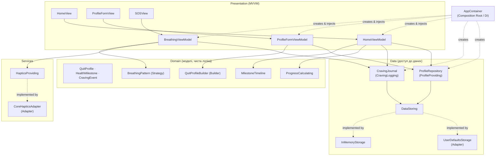

# Архітектура — практична робота 2

## Чому MVVM

Проєкт — переважно UI, що реагує на зміну стану (лічильники, форма, дихальна
вправа), без складної багатокрокової навігації чи модульної команди (де
виправдана VIPER) і без потреби в масивних Controller-ах (типова проблема MVC
у SwiftUI). SwiftUI + `@Observable` роблять зв'язок View ↔ ViewModel майже
безкоштовним: View лише показує стан і передає події, ViewModel не знає про
`View` взагалі. Це і обрано.

Обмеження: для дуже простих екранів MVVM додає прошарок, що виглядає
надлишковим (наприклад, `ScenarioView` практичної 1 такого прошарку не мала).

## Схема компонентів

Джерело: [docs/diagrams/architecture.mmd](diagrams/architecture.mmd) (Mermaid).

Напрямок стрілок = напрямок залежності. Presentation залежить від Domain/Data
**через протоколи** (`ProfileProviding`, `CravingLogging`, `DataStoring`,
`HapticsProviding`), а не від конкретних класів. `AppContainer` — єдине місце,
що знає про конкретні реалізації, і єдине місце, де є `import` двигуна
CoreHaptics поза `Services/Haptics`.

## Патерни проєктування (три категорії)

### Породжувальний — Builder

**Задача.** `QuitProfile` валідний лише повністю заповненим, але форма вводу
заповнюється по кроках і повинна дозволяти проміжні неповні стани.

**Учасники.** Builder — `QuitProfileBuilder` (`Domain/Builders/QuitProfileBuilder.swift`);
Product — `QuitProfile`; Director — `ProfileFormViewModel.save()`, який викликає
кроки Builder-а в потрібному порядку.

**Де використовується.** `ProfileFormViewModel.save()` збирає введені у формі
значення через ланцюжок `.withQuitDate(...).withCigarettesPerDay(...)….build()`;
`build()` — єдине місце, де перевіряється коректність і народжується `QuitProfile`.

### Структурний — Adapter

**Задача.** Домену потрібен простий типізований інтерфейс збереження й простий
інтерфейс вібрації, а системні API (`UserDefaults`, `CHHapticEngine`) мають
незручні для домену «сирі» інтерфейси.

**Учасники.** Target — `DataStoring` / `HapticsProviding`; Adaptee — `UserDefaults`
/ `CHHapticEngine`; Adapter — `UserDefaultsStorage` (`Data/Storage/UserDefaultsStorage.swift`)
/ `CoreHapticsAdapter` (`Services/Haptics/CoreHapticsAdapter.swift`).

**Де використовується.** `AppContainer.live()` підключає обидва адаптери;
решта коду (репозиторії, `BreathingViewModel`) працює лише з протоколами.

### Поведінковий — Strategy

**Задача.** Кілька технік дихання (Box, 4-7-8, Calm) — взаємозамінні алгоритми
з однаковою послідовністю дій «вдих → пауза → видих», але різними параметрами.

**Учасники.** Strategy — протокол `BreathingPattern`; конкретні стратегії —
`BoxBreathing`, `FourSevenEightBreathing`, `CalmBreathing`
(`Domain/Breathing/BreathingPattern.swift`); Context — `BreathingSchedule` і
`BreathingViewModel`, які працюють з `any BreathingPattern`, не знаючи, яка
саме техніка обрана.

**Де використовується.** `SOSView`/`BreathingViewModel.select(patternID:)` —
користувач перемикає техніку в Picker; розрахунок фаз (`BreathingSchedule`) не
змінюється при додаванні нової техніки.

> Компоненти беруть участь у кількох ролях: наприклад, `ProfileFormViewModel` —
> і Director для Builder-а, і ViewModel у MVVM. Це пояснено в кожному розділі
> вище, а не приховано.

## SOLID

- **S — Single Responsibility.** `ProgressCalculator` тільки рахує прогрес;
  `UserDefaultsStorage` — тільки серіалізує/десеріалізує; `HomeViewModel` —
  тільки готує дані для екрана. Кожен клас має одну причину для зміни.
- **O — Open/Closed.** Нову техніку дихання можна додати новим типом, що
  реалізує `BreathingPattern`, — жодного `switch` у `BreathingSchedule`
  чіпати не потрібно (`Domain/Breathing/BreathingPattern.swift`).
- **L — Liskov Substitution.** Будь-яка реалізація `DataStoring`
  (`UserDefaultsStorage`, `InMemoryStorage`, тестовий `FailingStorage`)
  взаємозамінна — код, що приймає `DataStoring`, поводиться коректно
  незалежно від конкретного типу.
- **I — Interface Segregation.** Замість одного «товстого» протоколу —
  окремі вузькі: `ProfileProviding` (профіль), `CravingLogging` (журнал),
  `HapticsProviding` (вібрація). `HomeViewModel` не залежить від методів
  вібрації, яких ніколи не використовує.
- **D — Dependency Inversion.** `HomeViewModel`, `BreathingViewModel`,
  `ProfileFormViewModel` залежать від протоколів, а не від `UserDefaults` чи
  `CoreHaptics` напряму. Конкретні реалізації підставляє `AppContainer`
  (Dependency Injection через `init`).

### Заміна реалізації сервісу тестовою

`AppContainer.demo()` (`App/AppContainer.swift`) підміняє `UserDefaultsStorage`
на `InMemoryStorage` і `CoreHapticsAdapter` на `NoOpHaptics`, не змінюючи
жодного рядка в `HomeViewModel`/`BreathingViewModel` — вони отримують
залежності лише через протоколи. Той самий механізм використовують тести
(`SmokeFreeTests/Support/TestDoubles.swift`: `MockProfileRepository`,
`MockJournal`, `SpyHaptics`, `FixedCalculator`, `FailingStorage`).

Запуск демо-режиму: Product ▸ Scheme ▸ Edit Scheme ▸ Run ▸ Arguments ▸
Arguments Passed On Launch → додати `-demo-data`.

## Антипатерни: що перевірено і як уникнуто

| Антипатерн | Як перевірено / уникнуто |
|---|---|
| **Масивний View/ViewModel** («Massive View Controller») | Кожна ViewModel відповідає за один екран; форматування винесено в `Formatters`, розрахунок прогресу — в `ProgressCalculator`, вибір наступного етапу — в `MilestoneTimeline`. `HomeViewModel` не містить логіки форматування чи розрахунку самостійно. |
| **Дублювання** | Форматування грошей/часу — лише в `Presentation/Common/Formatters.swift`; ключі сховища — лише в `StorageKey`; логіка етапів — лише в `MilestoneTimeline` (використовується і `HomeViewModel`, і майбутнім екраном списку етапів). |
| **Приховані глобальні залежності (сінглтони)** | У проєкті немає `.shared`. Усі залежності передаються через `init` (`AppContainer`, конструктори ViewModel). Це дозволяє `AppContainer.demo()`/тестам підміняти будь-яку залежність. |
| **Пряме поєднання UI з доступом до даних** | Жоден `View` не звертається до `UserDefaults`, `CoreHaptics` чи мережі напряму — лише до ViewModel, яка отримує абстракції (`ProfileProviding`, `HapticsProviding`). |

## Заміна залежності без переписування компонента

`ProfileFormViewModel` приймає `ProfileProviding`, а не `ProfileRepository`.
У `ProfileFormViewModelTests` (`SmokeFreeTests/HomeViewModelTests.swift`)
підставлено `MockProfileRepository`, зокрема з режимом `shouldFail = true` для
перевірки обробки помилки збереження, — сам `ProfileFormViewModel` не
змінювався.
