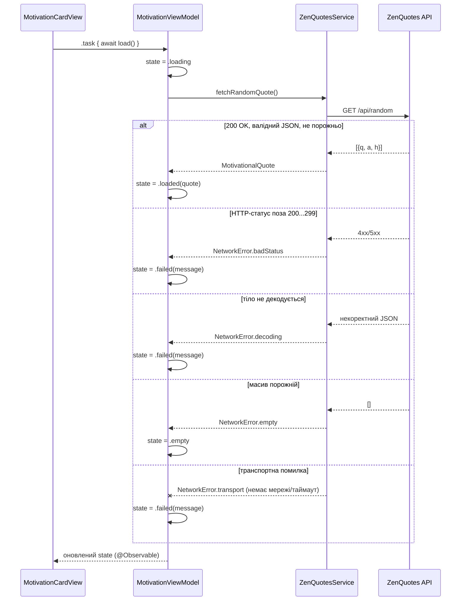

# Мережевий шар — практична робота 4

## Джерело даних

**ZenQuotes API** (<https://zenquotes.io/>) — відкрите API мотиваційних цитат,
без реєстрації й без ключа на безкоштовному рівні. Обрано за темою застосунку:
на екрані «Прогрес» цитата підтримує користувача поруч із лічильниками й
етапами відновлення — так само, як SOS-екран підтримує в гострий момент тяги.

| | |
|---|---|
| Базова адреса | `https://zenquotes.io/api` |
| Endpoint | `GET /random` — одна випадкова цитата |
| Параметри | немає |
| Формат відповіді | JSON-масив з одним об'єктом: `[{ "q": String, "a": String, "h": String }]` (`q` — текст, `a` — автор, `h` — готовий HTML, не використовується) |
| Авторизація | не потрібна. Обмеження безкоштовного рівня: до 5 запитів/30 с на IP; обов'язкова атрибуція посиланням на zenquotes.io при показі цитати (є в `MotivationCardView`) |

Приклад відповіді:

```json
[{"q":"Quality means doing it right when no one is looking.","a":"Henry Ford","h":"<blockquote>…</blockquote>"}]
```

## Мережевий компонент

Єдине місце, що знає про `URLSession`/`URLRequest`, — `Network/ZenQuotesService.swift`.
Жоден `View` чи `ViewModel` не робить HTTP-викликів напряму.

```
Network/
├── HTTPClient.swift        # протокол над URLSession.data(for:) — для підміни в тестах
├── NetworkError.swift      # transport / badStatus / decoding / empty
├── MotivationalQuote.swift # доменна модель + ZenQuoteDTO (Decodable)
├── QuoteFetching.swift     # протокол джерела цитат (Dependency Inversion)
├── ZenQuotesService.swift  # реальна реалізація на URLSession
└── StubQuoteServices.swift # EmptyQuoteService / FailingQuoteService — керовані негативні сценарії
```

## Реальний асинхронний запит і Decodable

`ZenQuotesService.fetchRandomQuote()` — `async throws`-метод: виконує
`URLSession.data(for:)`, перевіряє HTTP-статус, декодує `[ZenQuoteDTO]` через
`JSONDecoder`, мапить перший елемент у доменну модель `MotivationalQuote`.
Використовується в реальному сценарії: `MotivationCardView` на екрані
«Прогрес» показує цитату при появі та за кнопкою «Оновити».

## Місце в архітектурі (Dependency Inversion)



`MotivationViewModel` залежить від протоколу `QuoteFetching`, а не від
`ZenQuotesService` напряму (Dependency Inversion — той самий принцип, що й у
практичній 2 для `DataStoring`/`HapticsProviding`). `AppContainer` — єдине
місце, де ці два з'єднуються. `MotivationCardView` отримує стан лише через
`MotivationViewModel.state`, тобто UI отримує дані через компонент обраної
архітектури (MVVM), а не напряму з мережі.

Оновлення UI на головному акторі: `MotivationViewModel` позначено `@MainActor`,
тому `state = .loaded(...)` завжди виконується на головному потоці, хоча сам
мережевий виклик (`URLSession.data(for:)`) відбувається асинхронно й не
блокує інтерфейс — решта Home (лічильники, кнопки) лишається інтерактивною
під час завантаження цитати.

## Стани екрана

`MotivationViewModel.State`: `.idle` → `.loading` → один з
`.loaded(MotivationalQuote)` / `.empty` / `.failed(String)`.
`MotivationCardView` показує кожен стан окремо: індикатор завантаження,
текст цитати з автором, повідомлення «немає цитати» чи повідомлення помилки —
у двох останніх випадках з кнопкою **«Повторити»**.

## Обробка відмов

`NetworkError` розрізняє три види, як вимагає завдання:

- **`.transport`** — запит не дійшов (немає мережі, таймаут, обірване з'єднання).
- **`.badStatus(code:)`** — сервер відповів, але код поза `200...299`.
  **Перевіряється до спроби декодування** (`ZenQuotesServiceTests.testBadHTTPStatusIsReportedBeforeDecoding`
  навмисно надсилає невалідний JSON із кодом 500 і перевіряє, що помилка —
  саме `.badStatus`, а не `.decoding`).
- **`.decoding`** — тіло не відповідає очікуваній моделі.
- **`.empty`** — окремий випадок: відповідь коректна (200, валідний JSON), але
  масив порожній.

## Перевірка поведінки

1. **Реальний успішний запит**: запустити застосунок (⌘R) без додаткових
   аргументів — картка «Цитата дня» на Home показує реальну цитату з
   zenquotes.io; кнопка «Оновити» робить новий запит.
2. **Керована порожня відповідь**: Product ▸ Scheme ▸ Edit Scheme ▸ Run ▸
   Arguments → додати `-quote-empty` → запустити — картка одразу показує стан
   «Наразі немає жодної цитати» з кнопкою «Повторити» (`EmptyQuoteService`,
   без вимкнення мережі).
3. **Керована помилка**: аргумент `-quote-error` — картка показує повідомлення
   про відсутність з'єднання з кнопкою «Повторити» (`FailingQuoteService`).
4. **Автоматизовані тести** (`SmokeFreeTests/NetworkTests.swift`,
   `Support/MockHTTPClient.swift`): успіх, транспортна помилка, невдалий
   статус (до декодування), помилка декодування, порожній масив —
   без реального мережевого виклику.
